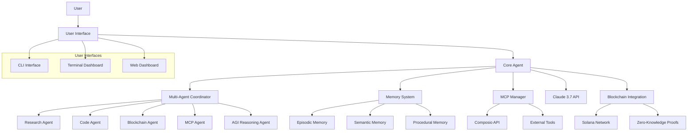

# OrganiX Agent Documentation

## Table of Contents

1. [Introduction](#introduction)
2. [Architecture](#architecture)
3. [Core Components](#core-components)
4. [Multi-Agent System](#multi-agent-system)
5. [Memory System](#memory-system)
6. [MCP Integration](#mcp-integration)
7. [Blockchain & ZK Proofs](#blockchain--zk-proofs)
8. [Advanced Chat Capabilities](#advanced-chat-capabilities)
9. [API Reference](#api-reference)
10. [Deployment Guide](#deployment-guide)
11. [Troubleshooting](#troubleshooting)

## Introduction

OrganiX is a comprehensive agent framework that integrates Model Context Protocol (MCP) with advanced AI capabilities to create a powerful, extensible system. It combines multiple specialized agents, memory management, web research, and blockchain integration into a unified platform.

### Key Features

- **Multi-Agent Architecture**: Specialized agents coordinate to handle different types of queries
- **Enhanced Memory System**: Multi-tiered memory with importance ratings and caching
- **MCP Integration**: Full support for Composio's Model Context Protocol
- **Blockchain Integration**: Solana blockchain support with Phantom wallet connectivity
- **Zero-Knowledge Proofs**: Privacy-preserving verification mechanisms
- **Cross-Platform Support**: Works on Windows, Linux, and cloud environments
- **Web Research Capabilities**: Integrated web search and information extraction
- **Conversation Management**: Save, load, and manage conversation history

## Architecture



## Core Components

### Agent System

The main agent (`ClaudeAgent`) coordinates all components and serves as the central hub. It handles:

- Processing user requests
- Routing to specialized agents
- Memory management
- Tool integration
- User interfaces

### Claude Client

The `ClaudeClient` class manages communication with the Claude 3.7 API:

- Message handling
- Response streaming
- Conversation management
- Extended thinking mode
- Response analysis

### Memory System

The `MemorySystem` provides persistent storage and retrieval:

- Episodic memory for conversations
- Semantic memory for facts and knowledge
- Procedural memory for action patterns
- Importance-based retention
- Memory caching for performance

## Multi-Agent System

OrganiX uses a multi-agent architecture to handle different types of queries through specialized agents. Each agent has its own persona and expertise area.

### Available Agents

| Agent ID | Name | Description |
|----------|------|-------------|
| researcher | Research Specialist | Deep research and information synthesis |
| coder | Code Specialist | High-quality code solutions and explanations |
| blockchain | Blockchain Specialist | Solana blockchain expertise and wallet integration |
| mcp_specialist | MCP Integration Specialist | Model Context Protocol implementation expertise |
| agi_reasoner | AGI Reasoning Specialist | Complex reasoning and advanced cognition |

### Agent Coordination

The `MultiAgentCoordinator` manages interaction between agents:

```python
# Initialize the coordinator
coordinator = MultiAgentCoordinator()

# Route to the best agent automatically
result = await coordinator.route_to_best_agent("What are the latest advances in AI?")

# Use collaborative reasoning with multiple agents
result = await coordinator.collaborative_reasoning(
    "Compare traditional finance with DeFi on Solana",
    agents=["researcher", "blockchain", "agi_reasoner"]
)
```

### Intent Detection

The system automatically detects user intent to route queries to the appropriate agent:

- Questions → Research Specialist
- Code requests → Code Specialist
- Blockchain queries → Blockchain Specialist
- MCP questions → MCP Specialist
- Complex reasoning → AGI Reasoning Specialist

## Memory System

The memory system provides persistent storage with advanced features:

### Memory Types

- **Episodic Memory**: Conversations and interactions
- **Semantic Memory**: Facts, information, and knowledge
- **Procedural Memory**: Procedures, patterns, and processes

### Key Features

- **Importance Rating**: Memories have importance scores (1-5)
- **Memory Caching**: Frequently accessed memories are cached
- **Contextual Retrieval**: Retrieve by relevance, timeframe, or importance
- **Memory Maintenance**: Automatic pruning of old, low-importance memories
- **Memory Analytics**: Statistics and usage patterns

### Usage Examples

```python
# Add a memory with importance
memory_id = memory_system.add_memory(
    "semantic",
    "Claude is an AI assistant created by Anthropic",
    {"type": "fact", "category": "AI"},
    importance=4
)

# Retrieve relevant memories
memories = memory_system.retrieve_relevant(
    "Who created Claude?",
    memory_type="semantic",
    limit=5,
    min_importance=3
)

# Retrieve by timeframe
last_week_memories = memory_system.retrieve_by_timeframe(
    datetime.now() - timedelta(days=7),
    memory_type="episodic"
)

# Get memory statistics
stats = memory_system.get_memory_stats()
```

## MCP Integration

OrganiX fully integrates with the Model Context Protocol (MCP) for extensible tool usage.

### What is MCP?

Model Context Protocol is a standard for integrating external tools with AI models. It allows models to:

1. Call external tools and APIs
2. Process results from those tools
3. Incorporate tool outputs into responses

### Composio Integration

OrganiX integrates with Composio's MCP implementation:

```python
# Register a tool with MCP
mcp_manager.register_tool(
    "weather",
    "Get current weather for a location",
    get_weather_function
)

# Process a query using MCP tools
result = await mcp_manager.process_with_tools(
    "What's the weather in New York?"
)
```

### Available Tools

OrganiX comes with several built-in tools:

| Tool Name | Description |
|-----------|-------------|
| web_search | Search the web for information |
| retrieve_memory | Retrieve memories by relevance |
| execute_command | Run system commands |
| get_solana_balance | Get Solana wallet balance |
| get_nfts_by_owner | Get NFTs owned by an address |

### Creating Custom Tools

You can easily create custom tools:

```python
def calculate_mortgage(principal, rate, years):
    monthly_rate = rate / 100 / 12
    num_payments = years * 12
    payment = principal * (monthly_rate * (1 + monthly_rate)**num_payments) / ((1 + monthly_rate)**num_payments - 1)
    return {
        "monthly_payment": payment,
        "total_cost": payment * num_payments,
        "total_interest": (payment * num_payments) - principal
    }

# Register the tool
mcp_manager.register_tool(
    "calculate_mortgage",
    "Calculate mortgage payments",
    calculate_mortgage
)
```

## Blockchain & ZK Proofs

OrganiX includes advanced blockchain and zero-knowledge proof capabilities.

### Solana Integration

Access Solana blockchain data and functionality:

```python
# Get Solana account balance
balance = await solana_integration.get_solana_balance("FxsqrtTMuAKYgNwiGRD3FwVr1FtsrfUJMPWq49dZVERP")

# Get NFTs owned by an address
nfts = await solana_integration.get_nfts_by_owner("FxsqrtTMuAKYgNwiGRD3FwVr1FtsrfUJMPWq49dZVERP")

# Get token accounts
tokens = await solana_integration.get_solana_token_accounts("FxsqrtTMuAKYgNwiGRD3FwVr1FtsrfUJMPWq49dZVERP")
```

### Phantom Wallet Integration

Connect to the Phantom wallet:

```python
# Generate a wallet connection URL
connection = solana_integration.generate_phantom_connection_url(
    dapp_url="https://example.com",
    redirect_url="https://example.com/callback"
)

# Get HTML for a connect button
button_html = solana_integration.create_agent_wallet_button_html("OrganiX Dashboard")
```

### Zero-Knowledge Proofs

Create and verify zero-knowledge proofs:

```python
# Create a proof of knowledge
proof = await zk_proofs.create_proof_of_knowledge(sensitive_data)

# Create a proof of ownership
ownership_proof = await zk_proofs.create_proof_of_ownership(address, asset_id)

# Verify a proof
verification = zk_proofs.verify_proof(proof)
```

## Advanced Chat Capabilities

OrganiX includes numerous advanced chat capabilities:

### Multi-Agent Coordination

```python
# Route to best agent automatically
result = await coordinator.route_to_best_agent("How does quantum computing work?")

# Use collaborative reasoning
result = await coordinator.collaborative_reasoning(
    "What are the ethical implications of AGI?",
    agents=["researcher", "agi_reasoner"]
)

# Get coordination statistics
stats = coordinator.get_coordination_stats()
```

### Context Awareness

```python
# Process with context from previous interactions
result = await coordinator.process_with_context_awareness(
    "Tell me more about that"
)

# Process with specific context
result = await coordinator.process_with_context_awareness(
    "What are its advantages?",
    context="We were discussing quantum computing and its applications in cryptography."
)
```

### Chat Personas

```python
# Create a custom persona
custom_persona = ChatPersona(
    name="Finance Expert",
    description="Specialized in financial analysis and advice",
    system_prompt="You are a Finance Expert within OrganiX...",
)

# Register the persona
coordinator.register_agent("finance", custom_persona)

# Use the persona
result = await coordinator.process_with_agent("finance", "How should I diversify my portfolio?")
```

## API Reference

### ClaudeAgent

The main agent class that coordinates all components.

| Method | Description |
|--------|-------------|
| `process_query(query, system_prompt=None, max_tokens=4096, extended_thinking=False)` | Process a user query |
| `stream_response(query, system_prompt=None, max_tokens=4096)` | Stream a response in real-time |
| `process_query_with_tools(query, tools=None, system_prompt=None, max_tokens=4096)` | Process a query using tools |
| `research_topic(topic, max_results=5)` | Research a topic using web search |
| `connect_to_remote(host, username, password=None, key_file=None)` | Connect to a remote system |
| `get_memory_stats()` | Get memory system statistics |
| `save_conversation(filename=None)` | Save the current conversation |
| `load_conversation(filename)` | Load a conversation from a file |
| `summarize_memories(days=7)` | Summarize recent memories |
| `get_conversation_analytics()` | Get analytics about conversation |
| `maintain_memory()` | Perform memory maintenance |
| `create_new_conversation(title=None)` | Create a new conversation |

### MultiAgentCoordinator

Coordinates multiple specialized agents.

| Method | Description |
|--------|-------------|
| `route_to_best_agent(query)` | Route a query to the most appropriate agent |
| `process_with_agent(agent_id, query)` | Process a query with a specific agent |
| `process_with_context_awareness(query, context=None)` | Process with context awareness |
| `collaborative_reasoning(query, agents=None)` | Use multiple agents for complex reasoning |
| `process_with_mcp_tools(query, tool_names=None)` | Process using specific MCP tools |
| `get_coordination_stats()` | Get statistics about agent coordination |
| `get_agi_capabilities_info()` | Get information about AGI capabilities |

### MemorySystem

Manages different types of memory.

| Method | Description |
|--------|-------------|
| `add_memory(memory_type, content, metadata=None, importance=1)` | Add a new memory |
| `retrieve_relevant(query, memory_type=None, limit=5, min_importance=0)` | Retrieve relevant memories |
| `retrieve_by_timeframe(start_time, end_time=None, memory_type=None, limit=20)` | Retrieve memories by timeframe |
| `update_memory(memory_id, content=None, metadata=None)` | Update an existing memory |
| `delete_memory(memory_id)` | Delete a memory |
| `prune_old_memories(max_age_days=None)` | Delete old memories |
| `summarize_memories(memory_type=None, timeframe_days=7, limit=50)` | Generate a summary of recent memories |
| `get_memory_stats()` | Get memory statistics |
| `clear_memory_cache()` | Clear the memory cache |

## Deployment Guide

### Local Deployment

1. Clone the repository:
   ```bash
   git clone https://github.com/kabrony/claude-agent-mcp.git
   cd claude-agent-mcp
   ```

2. Run the installation script:
   - Windows: `install_dependencies.bat`
   - Linux/Mac: `./install_dependencies.sh`

3. Create a `.env` file with your API keys:
   ```
   ANTHROPIC_API_KEY=your_anthropic_api_key_here
   CLAUDE_MODEL=claude-3-7-sonnet-20250219
   EXA_API_KEY=your_exa_api_key_here
   COMPOSIO_API_KEY=your_composio_api_key_here
   COMPOSIO_CONNECTION_ID=your_composio_connection_id_here
   ```

4. Launch the agent:
   - Windows: `launch_agent.bat`
   - Linux/Mac: `./launch_agent.sh`

### Docker Deployment

1. Build the Docker image:
   ```bash
   docker build -t organix-agent .
   ```

2. Run the container:
   ```bash
   docker run -p 8080:8080 -v $(pwd)/data:/app/data -e ANTHROPIC_API_KEY=your_key organix-agent
   ```

### Cloud Deployment

OrganiX can be deployed to various cloud environments:

- **AWS Lambda**: Use the serverless framework
- **Google Cloud Run**: Deploy as a container
- **Azure Functions**: Deploy as a function app

## Troubleshooting

### Common Issues

#### API Key Issues

If you get an error about invalid API keys, check:
- Your `.env` file is properly formatted
- API keys are valid and not expired
- Environment variables are loaded correctly

#### Memory Errors

If you encounter memory-related errors:
- Check if ChromaDB is properly installed
- Ensure the `memory_store` directory is writable
- Try running memory maintenance: `python agent.py --maintenance`

#### Tool Execution Failures

If tool execution fails:
- Verify the tool is properly registered
- Check if all dependencies are installed
- Look for errors in function implementation

### Getting Help

If you need assistance:
- Check the GitHub issues: https://github.com/kabrony/claude-agent-mcp/issues
- Create a new issue with detailed information
- Join our community Discord for real-time help
