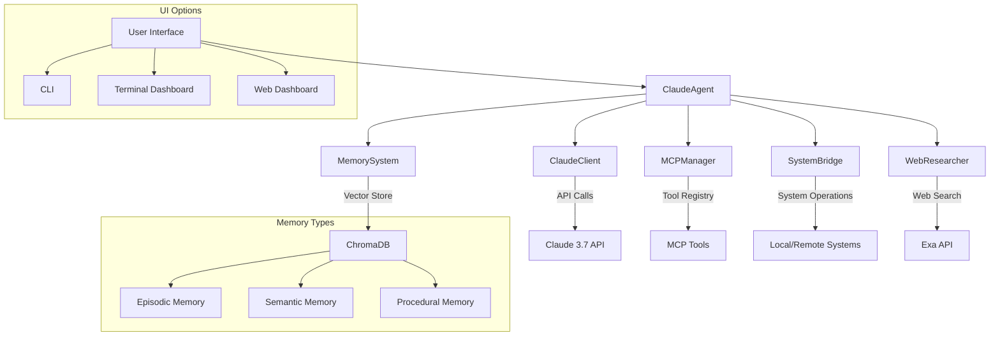
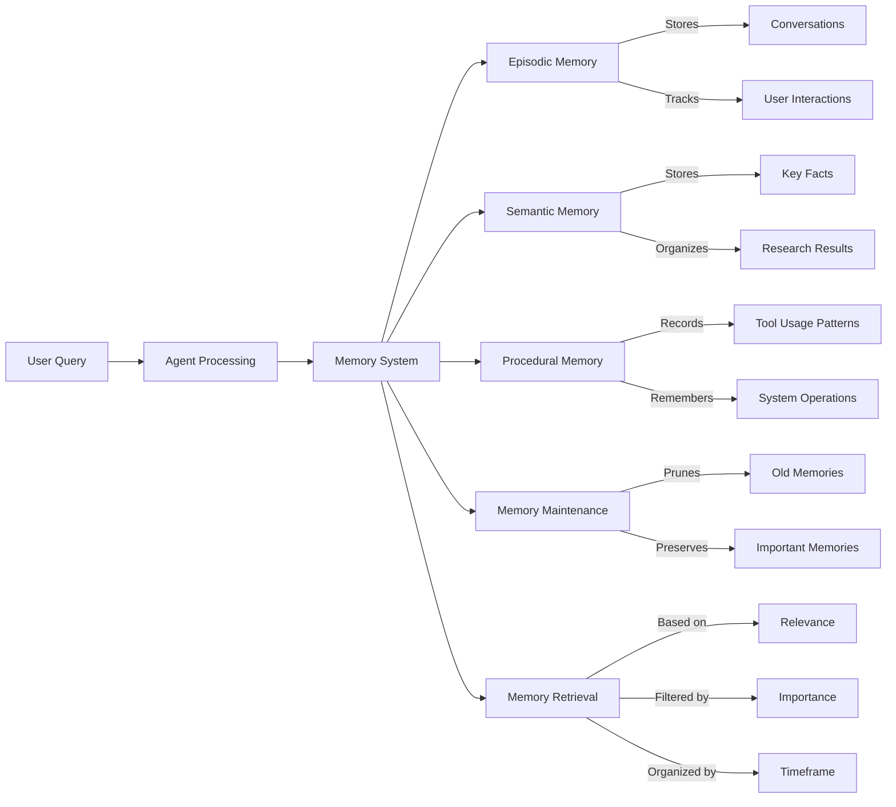

# OrganiX Claude Agent

OrganiX is a powerful personal agent with cross-platform capabilities and Model Context Protocol (MCP) integration using the Claude 3.7 API. This agent features enhanced memory capabilities and advanced AI chat functionality.

## Features

- 🧠 **Advanced Memory System**: Multi-tiered ChromaDB-based memory with episodic, semantic, and procedural memory types
- 🤖 **Enhanced Claude Integration**: Conversation management, streaming, tool integration, and extended thinking
- 🔄 **Cross-Platform Operations**: Seamlessly works across Windows and Linux environments
- 🔍 **Web Research Capabilities**: Integrated with Exa for comprehensive web search and content extraction
- 🧰 **Full MCP Support**: Extensible tool usage with structured formats
- 📊 **Rich Terminal Interface**: Beautifully formatted outputs and dashboards using Rich
- 🔄 **Streaming Support**: Real-time streaming responses from Claude API
- 💻 **Remote System Connectivity**: SSH integration for remote Ubuntu systems
- 📈 **Memory Analytics**: Track and analyze memory usage statistics
- 🔄 **Conversation Management**: Save, load, and switch between conversations

## System Architecture



## Memory System

The enhanced memory system uses ChromaDB for vector storage and retrieval, with three distinct memory types:



## Quick Start

### Windows

1. Clone this repository
```bash
git clone https://github.com/kabrony/claude-agent-mcp.git
cd claude-agent-mcp
```

2. Run `install_dependencies.bat` to set up the environment
3. Create a `.env` file with your API keys (see Environment Variables section)
4. Activate the virtual environment: `venv\Scripts\activate`
5. Run the agent: `python agent.py --query "Your question here"`

### Linux/Mac

1. Clone this repository
```bash
git clone https://github.com/kabrony/claude-agent-mcp.git
cd claude-agent-mcp
```

2. Make the installation script executable: `chmod +x install_dependencies.sh`
3. Run `./install_dependencies.sh` to set up the environment
4. Create a `.env` file with your API keys (see Environment Variables section)
5. Activate the virtual environment: `source venv/bin/activate`
6. Run the agent: `python agent.py --query "Your question here"`

## Environment Variables

Create a `.env` file in the project root with the following variables:

```
ANTHROPIC_API_KEY=your_anthropic_api_key_here
EXA_API_KEY=your_exa_api_key_here
```

You can obtain these API keys from:
- [Anthropic Console](https://console.anthropic.com/)
- [Exa Dashboard](https://exa.ai/)

## Usage

### Terminal Dashboard

OrganiX includes a rich terminal dashboard for interactive use:

```bash
# Launch the dashboard
python dashboard.py

# Start dashboard with initial query
python dashboard.py --query "What's the latest news on AI?"
```

The enhanced dashboard provides:
- Real-time conversation history with markdown rendering
- System information monitoring
- Detailed memory statistics and analytics
- Tool availability indicators
- Multiple conversation management
- Interactive query input with extended thinking option

### Basic Commands

```bash
# Process a query
python agent.py --query "What is the weather today?"

# Stream a response (real-time output)
python agent.py --query "Tell me about quantum computing" --stream

# Use tools for a query
python agent.py --query "List the files in my current directory" --tools

# Use extended thinking mode
python agent.py --query "Explain the theory of relativity" --extended-thinking

# Research a topic
python agent.py --research "Climate change solutions"

# Display agent information
python agent.py

# Perform memory maintenance
python agent.py --maintenance

# Save conversation to file
python agent.py --save my_conversation.json

# Load conversation from file
python agent.py --load my_conversation.json
```

### Advanced Usage

```python
# Using the agent in your own code
import asyncio
from agent import ClaudeAgent

async def main():
    agent = ClaudeAgent()
    
    # Process a query with extended thinking
    response = await agent.process_query(
        "What is the meaning of life?", 
        extended_thinking=True
    )
    print(response)
    
    # Process a query with tools
    response = await agent.process_query_with_tools(
        "What's the current time and weather in New York?"
    )
    print(response)
    
    # Research a topic
    research = await agent.research_topic("Artificial intelligence ethics")
    print(research)
    
    # Connect to remote system
    result = await agent.connect_to_remote("your-server.com", "username", password="password")
    print(result)
    
    # Get memory statistics
    stats = agent.get_memory_stats()
    print(stats)
    
    # Summarize recent memories
    summary = agent.summarize_memories(days=7)
    print(summary)
    
    # Create new conversation
    agent.create_new_conversation("Philosophy Discussion")

asyncio.run(main())
```

## Enhanced Components

### Improved Memory System

The refactored memory system features:

- **Memory Importance Rating**: Prioritize memories by importance
- **Memory Caching**: Faster retrieval of frequently accessed memories
- **Timeframe-based Retrieval**: Access memories from specific time periods
- **Memory Maintenance**: Automatically prune old, low-importance memories
- **Memory Summarization**: Generate summaries of recent memories
- **Memory Analytics**: Track and analyze memory usage patterns

### Enhanced Claude Client

The improved Claude client includes:

- **Multiple Conversation Management**: Create, save, and switch between conversations
- **Tools Integration**: Seamless integration with MCP tools
- **Extended Thinking Mode**: Enable deeper reasoning for complex queries
- **Response Analysis**: Extract key points and analyze sentiment
- **Streaming Support**: Real-time response streaming
- **Usage Analytics**: Track token usage and API calls

## Project Structure

```
claude-agent-mcp/
├── agent.py                # Enhanced main agent implementation
├── claude_client.py        # Advanced Claude API client with conversation management
├── dashboard.py            # Rich terminal dashboard with memory analytics
├── memory_system.py        # Improved memory system with caching and importance ratings
├── mcp_manager.py          # Model Context Protocol integration
├── system_bridge.py        # Cross-platform functionality
├── web_research.py         # Web search capabilities
├── utils.py                # Utility functions
├── web_server.py           # Web dashboard backend
├── web_dashboard/          # Web UI files
│   └── index.html          # Web dashboard frontend
├── requirements.txt        # Dependencies
├── install_dependencies.bat # Windows setup
└── install_dependencies.sh  # Linux/Mac setup
```

## GitHub Integration

This project is hosted on GitHub at [https://github.com/kabrony/claude-agent-mcp](https://github.com/kabrony/claude-agent-mcp). To contribute:

1. Fork the repository
2. Create a feature branch: `git checkout -b feature/amazing-feature`
3. Commit your changes: `git commit -m 'Add some amazing feature'`
4. Push to the branch: `git push origin feature/amazing-feature`
5. Open a Pull Request

## Requirements

- Python 3.8 or higher
- Dependencies listed in `requirements.txt`

## License

MIT License

## Acknowledgments

- Built with [Anthropic Claude 3.7](https://www.anthropic.com/claude)
- Utilizes [ChromaDB](https://github.com/chroma-core/chroma) for vector storage
- Enhanced with [Exa](https://exa.ai) for web search capabilities
- Terminal UI powered by [Rich](https://github.com/Textualize/rich)
