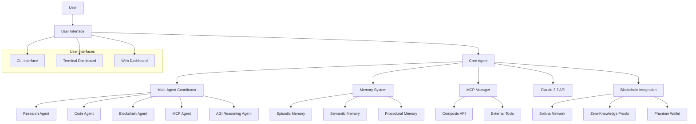
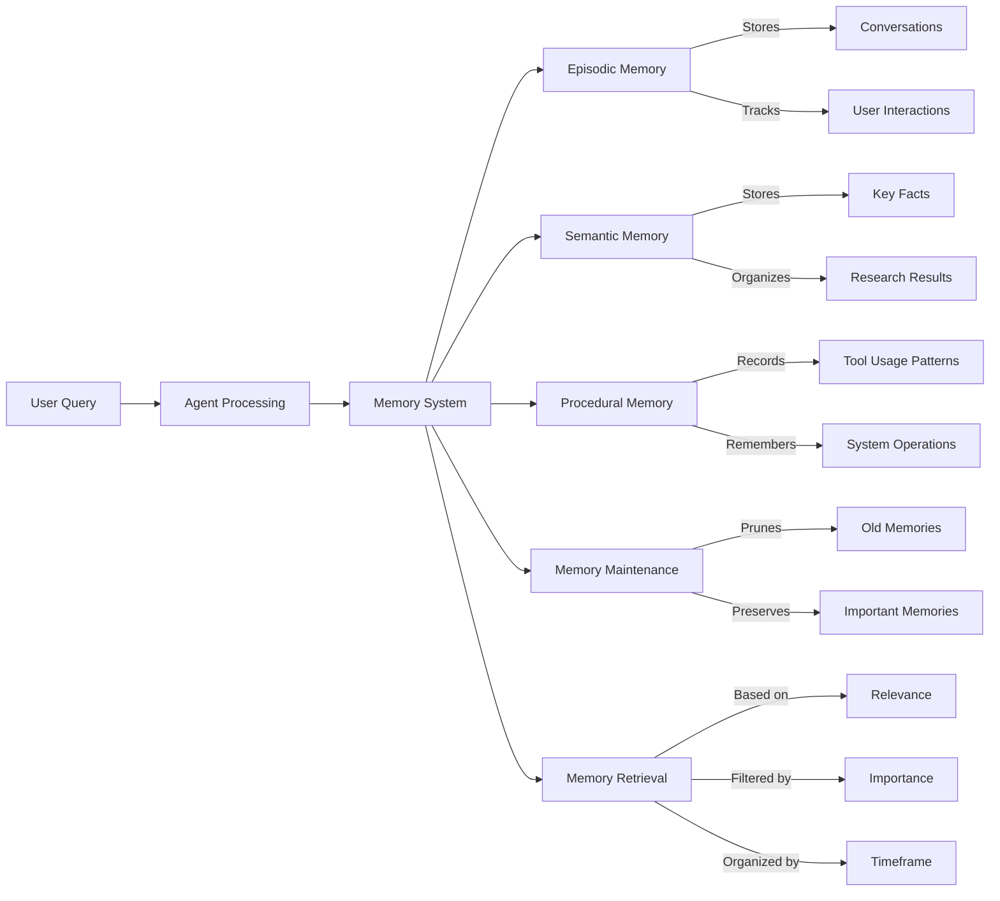

# OrganiX Agent

 | [Twitter @0xOrganix](https://x.com/0xOrganix)

OrganiX is an advanced AI agent platform with powerful cross-platform capabilities, featuring Claude 3.7 integration, MCP (Model Context Protocol), multi-agent coordination, and blockchain connectivity.

## Key Features

- 🧠 **Advanced Multi-Agent System**: Specialized agents coordinate to handle different types of queries
- 🪄 **Zero-Knowledge Integration**: Privacy-preserving verification through ZK proofs
- 🔗 **Blockchain & Phantom Wallet**: Solana blockchain integration with Phantom wallet connectivity
- 🛠️ **Full MCP Support**: Integrate external tools using Composio's Model Context Protocol
- 💡 **AGI Reasoning Capabilities**: Complex reasoning through multi-agent collaboration
- 🧩 **Enhanced Memory**: Multi-tiered memory system with importance ratings and caching
- 🔍 **Web Research**: Integrated search and information extraction
- 💬 **Conversation Management**: Save, load, and manage multiple conversation sessions
- 🖥️ **Cross-Platform**: Works seamlessly on Windows, Linux, and cloud environments
- 📱 **Multiple Interfaces**: CLI, Terminal Dashboard, and Web Dashboard options

## System Architecture



## Memory System

The enhanced memory system uses ChromaDB for vector storage and retrieval, with three distinct memory types:



## Quick Start

### Using the Launch Script (Recommended)

The easiest way to get started is by using the launcher:

1. Clone this repository
```bash
git clone https://github.com/kabrony/claude-agent-mcp.git
cd claude-agent-mcp
```

2. Run the launcher for your platform:
   - Windows: `launch_agent.bat`
   - Linux/Mac: `./launch_agent.sh`

3. Follow the on-screen menu to initialize your environment and launch the agent

### Manual Setup

1. Clone this repository
2. Install dependencies:
   - Windows: `install_dependencies.bat`
   - Linux/Mac: `./install_dependencies.sh`
3. Create a `.env` file with your API keys (see Environment Variables section)
4. Activate the virtual environment:
   - Windows: `venv\Scripts\activate`
   - Linux/Mac: `source venv/bin/activate`
5. Run the agent: `python agent.py`

## Environment Variables

Create a `.env` file in the project root with the following variables:

```
# Required
ANTHROPIC_API_KEY=your_anthropic_api_key_here
CLAUDE_MODEL=claude-3-7-sonnet-20250219

# Optional - Web Research
EXA_API_KEY=your_exa_api_key_here

# Optional - MCP Integration
COMPOSIO_API_KEY=your_composio_api_key_here
COMPOSIO_CONNECTION_ID=your_composio_connection_id_here
COMPOSIO_INTEGRATION_ID=your_composio_integration_id_here

# Optional - Blockchain
SOLANA_RPC_URL=https://api.mainnet-beta.solana.com
SOLANA_PRIVATE_KEY=your_solana_private_key_here

# Optional - Zero-Knowledge Proofs
ENABLE_ZK_PROOFS=true

# Optional - Social Media
TWITTER_BEARER_TOKEN=your_twitter_bearer_token_here
```

## User Interfaces

### Terminal Dashboard

```bash
# Launch the dashboard
python dashboard.py

# Start dashboard with initial query
python dashboard.py --query "What's the latest news on AI?"
```

The enhanced dashboard provides:
- Real-time conversation history with markdown rendering
- System information monitoring
- Detailed memory statistics and analytics
- Tool availability indicators
- Multiple conversation management
- Model switching capabilities
- Interactive query input with extended thinking option

### Command Line Interface

```bash
# Process a query
python agent.py --query "What is quantum computing?"

# Stream a response (real-time output)
python agent.py --query "Tell me about quantum computing" --stream

# Use tools for a query
python agent.py --query "List the files in my current directory" --tools

# Use extended thinking mode
python agent.py --query "Explain the theory of relativity" --extended-thinking

# Research a topic
python agent.py --research "Climate change solutions"

# Display agent information
python agent.py

# Perform memory maintenance
python agent.py --maintenance

# Save conversation to file
python agent.py --save my_conversation.json

# Load conversation from file
python agent.py --load my_conversation.json
```

### Web Dashboard

```bash
# Start the web server
python web_server.py
```

Then open your browser to `http://localhost:8080`

## Advanced Features

### Multi-Agent System

OrganiX uses a multi-agent architecture with specialized agents:

| Agent | Expertise |
|-------|-----------|
| Research Specialist | Deep research and information synthesis |
| Code Specialist | High-quality code solutions |
| Blockchain Specialist | Solana blockchain expertise |
| MCP Specialist | Model Context Protocol integration |
| AGI Reasoning Specialist | Complex reasoning and cognition |

```python
# Use collaborative reasoning with multiple agents
result = await coordinator.collaborative_reasoning(
    "Compare traditional finance with DeFi on Solana",
    agents=["researcher", "blockchain", "agi_reasoner"]
)
```

### Blockchain & Phantom Wallet Integration

```python
# Get Solana account balance
balance = await solana_integration.get_solana_balance(address)

# Connect to Phantom wallet
connection_url = solana_integration.generate_phantom_connection_url(
    dapp_url="https://example.com",
    redirect_url="https://example.com/callback"
)
```

### Zero-Knowledge Proofs

```python
# Create a proof of knowledge
proof = await zk_proofs.create_proof_of_knowledge(sensitive_data)

# Verify a proof
verification = zk_proofs.verify_proof(proof)
```

### MCP Tool Integration

```python
# Register a custom tool
mcp_manager.register_tool(
    "calculate_mortgage",
    "Calculate mortgage payments",
    calculate_mortgage_function
)

# Process with MCP tools
result = await mcp_manager.process_with_tools(
    "What's my monthly payment on a $300,000 loan at 4.5% for 30 years?"
)
```

## Documentation

For complete documentation, see [DOCUMENTATION.md](DOCUMENTATION.md)

## Requirements

- Python 3.8 or higher
- Dependencies listed in `requirements.txt`

## License

MIT License

## Acknowledgments

- Built with [Anthropic Claude 3.7](https://www.anthropic.com/claude)
- Utilizes [ChromaDB](https://github.com/chroma-core/chroma) for vector storage
- Enhanced with [Exa](https://exa.ai) for web search capabilities
- Integrates with [Composio](https://composio.dev) for MCP
- Connects with [Solana](https://solana.com) and [Phantom](https://phantom.app)
- Terminal UI powered by [Rich](https://github.com/Textualize/rich)
